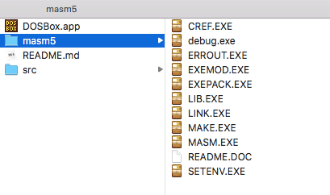
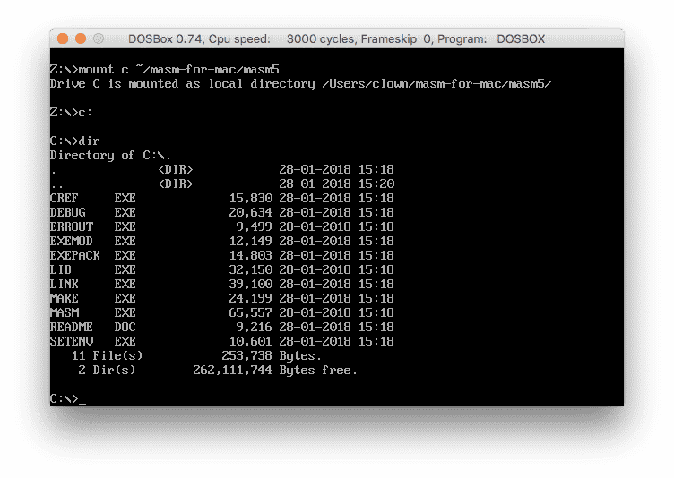
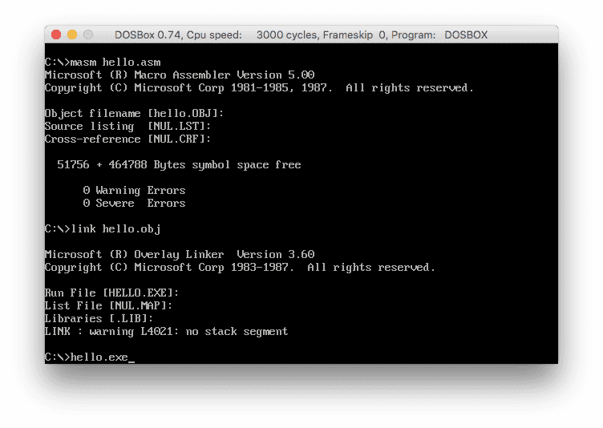
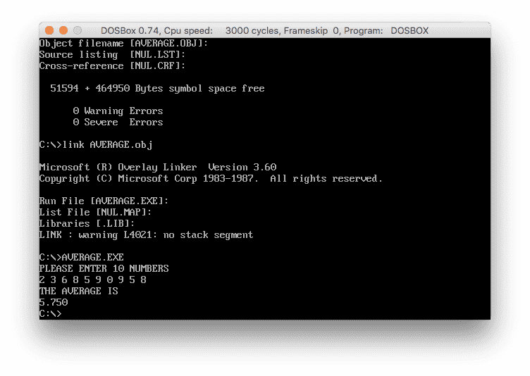
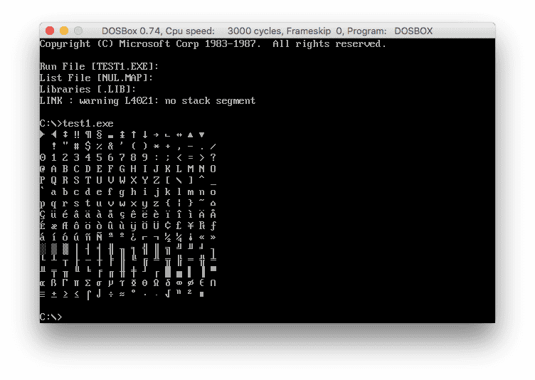
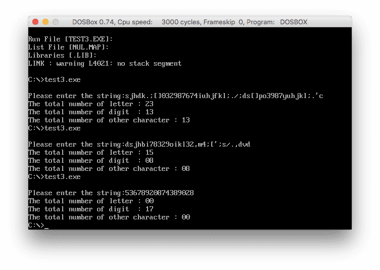
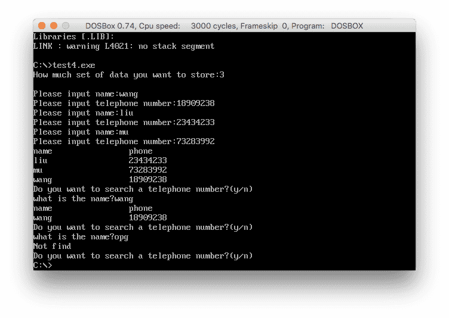

# masm-for-mac

### 使用教程

1. 到用户目录克隆文件

```bash
$ cd ~/
$ git clone https://github.com/wangriyu/masm-for-mac.git
```

`~/masm-for-mac`目录下应有以下文件，masm5是主要的编译链接文件，DOSBox.app提供沙盒环境，src中有一些事例代码



2. 打开DOSBox，输入mount指令挂载虚拟磁盘，盘符为c，目录是克隆下来的masm5文件夹路径，挂载成功后输入c:进入虚拟磁盘，再输入dir列出目录文件，输入HELP查看帮助，与windows环境的命令一致
```
$ mount c ~/masm-for-mac/masm5

$ c:

$ dir
```



3. 用自己常用的文本编辑器，比如VSCode打开文件目录，在masm5下新建asm文件(src中有一些事例)，用masm语法编写汇编代码，然后通过masm汇编、link链接后就可以运行输出

```
$ masm hello.asm
// 连按三次回车
$ link hello.obj
// 连按三次回车
$ hello.exe
```



4. 事例
   - 平均数计算，连续输入十个10以下的数，程序计算去掉一个最小数，去掉一个最大数后八个数的平均值，从显示器显示出来，结果保留3位小数



   - 按15行X16列的表格显示表示ASCII码为10H—100H的所有字符，即以行为主的顺序及ASCII码递增的次序一次显示对应的字符，每16个字符为一行，每行中的相邻的字符之间用空白（ASCII为0）隔开



   - 程序接受用户键入的一个关键字以及一个句子，如果句子中不包含关键字则显示“No match!”；如果句子中包含关键字则显示“match!”，且把该字在句子中的位置用十六进制数显示出来


   - 程序接受用户键入一行字符（字符个数不超过80个，该字符串用回车符结束），并按字母、数字、其它字符分类计数，然后将结果存入以letter、digit和other为名的存储单元中



   - 添加查找电话号码本，程序可接受输入人名及相应的电话号码，并把它们加入电话号码表中，程序可按人名对电话号码表重新排序，程序可接受需要查询电话号码的人名，并从电话号码表中查出其电话号码

